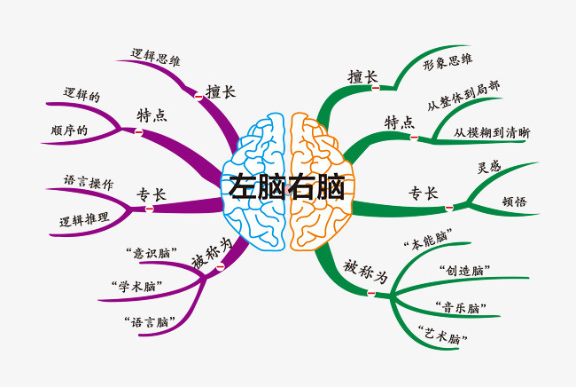
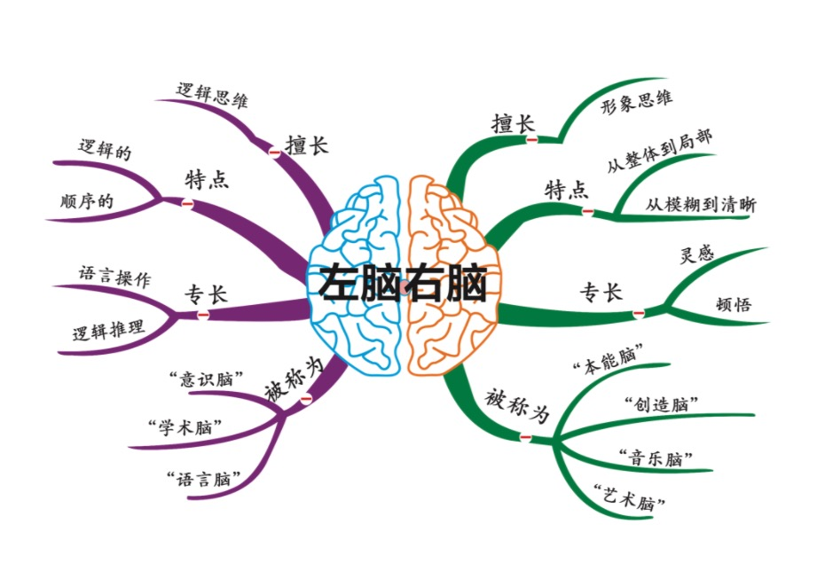

# XMind

**XMind** 是基于 Python 实现，提供了对 [XMind思维导图](https://www.xmind.cn/)进行创建、解析、更新的一站式解决方案！





### 一、安装方式
```
pip3 install XMind  or  pip3 install xmind
```


### 二、版本升级
```
pip3 install -U XMind
```


### 三、使用方式
```
# load an existing file or create a new workbook if nothing is found
workbook = xmind.load("demo.xmind")
# get the first sheet(a new workbook has a blank sheet by default)
sheet1 = workbook.getPrimarySheet()
design_sheet1(sheet1)
# create sheet2
gen_sheet2(workbook, sheet1)
# now we save as test.xmind
xmind.save(workbook, path='test.xmind')
```


### 四、自动化测试与发布

#### 1、自动化单元测试
```
python3 -m unittest discover
```

#### 2、一键打 Tag 并上传至 PYPI 
每次在 __ about __.py 更新版本号后，运行以下命令，实现自动化更新打包上传至 [PYPI](https://pypi.org/) ，同时根据其版本号自动打 Tag 并推送到仓库：
```
python3 setup.py pypi
```


### 五、致谢
在此，衷心感谢 **XMind 思维导图**官方创造了这么一款激发灵感、创意，提升工作、生活效率的高价值生产力产品，
同时还开源 [xmind-sdk-python](https://github.com/xmindltd/xmind-sdk-python) 工具帮助开发者构建自己的 XMind 文件 ，本项目正是基于此工具进行扩展和升级，受益匪浅，感恩！

得益于开源，也将坚持开源，并为开源贡献自己的点滴之力。后续，将继续根据实际项目需要，定期进行维护更新和完善，欢迎大伙的使用和[意见反馈](https://github.com/zhuifengshen/xmind/issues/new)，谢谢！

（如果本项目对你有帮助的话，也欢迎 _**star**_ ）


### LICENSE
```
The MIT License (MIT)

Copyright (c) 2019 Devin https://zhangchuzhao.site
Copyright (c) 2013 XMind, Ltd

Permission is hereby granted, free of charge, to any person obtaining a copy of
this software and associated documentation files (the "Software"), to deal in
the Software without restriction, including without limitation the rights to
use, copy, modify, merge, publish, distribute, sublicense, and/or sell copies of
the Software, and to permit persons to whom the Software is furnished to do so,
subject to the following conditions:

The above copyright notice and this permission notice shall be included in all
copies or substantial portions of the Software.

THE SOFTWARE IS PROVIDED "AS IS", WITHOUT WARRANTY OF ANY KIND, EXPRESS OR
IMPLIED, INCLUDING BUT NOT LIMITED TO THE WARRANTIES OF MERCHANTABILITY, FITNESS
FOR A PARTICULAR PURPOSE AND NONINFRINGEMENT. IN NO EVENT SHALL THE AUTHORS OR
COPYRIGHT HOLDERS BE LIABLE FOR ANY CLAIM, DAMAGES OR OTHER LIABILITY, WHETHER
IN AN ACTION OF CONTRACT, TORT OR OTHERWISE, ARISING FROM, OUT OF OR IN
CONNECTION WITH THE SOFTWARE OR THE USE OR OTHER DEALINGS IN THE SOFTWARE.
```
